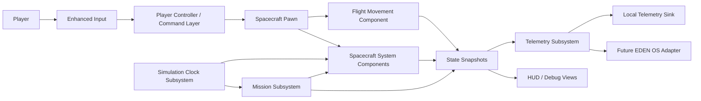

# Architecture

## 1. Architectural style

Eden Space Simulator uses a component-oriented Unreal architecture with explicit state ownership and a ports-and-adapters boundary around external telemetry.

The architecture favors:

- Composition over deep inheritance
- Small public APIs
- Data-driven configuration
- Event-driven communication for presentation
- Fixed-step domain simulation
- Immutable telemetry snapshots
- Testable C++ domain calculations
- Blueprints as composition and presentation tools

## 2. System context



## 3. Dependency direction

```text
Presentation and Input
        |
        v
Application / Orchestration
        |
        v
Simulation Domain
        |
        v
Unreal Engine primitives and stable utility code

External adapters depend inward on telemetry contracts.
The domain does not depend outward on HTTP, widgets, or EDEN OS.
```

Rules:

- UI may query snapshots and issue commands.
- UI may not mutate system internals.
- Mission orchestration may call public system commands.
- A system component may not reach into another component's private state.
- Cross-system interactions use explicit coordinator logic, commands, or immutable input/output values.
- Telemetry depends on snapshot contracts, not concrete widgets or network clients.
- External adapters may fail without corrupting authoritative simulation state.
- No circular dependencies.

## 4. Proposed runtime responsibilities

### `AEdenSpacecraftPawn`

Responsibilities:

- Represents the controllable spacecraft actor.
- Owns spacecraft component composition.
- Creates the required collision root, flight movement component, and resource-system components as C++ default subobjects.
- Routes high-level input commands.
- Exposes a narrow state-query surface for orchestration and presentation.

It does not own mission progression, telemetry delivery, widget logic, fuel quantity, battery charge, temperature, or resource simulation rules.

### `UEdenFlightMovementComponent`

Responsibilities:

- Applies translation and rotation commands.
- Owns velocity and movement-related configuration that is not already authoritative in Unreal physics.
- Implements flight stabilization policy.
- Implements `IEdenPropulsionDemandSource` and exposes normalized propulsion demand for resource systems.
- Produces movement state for snapshots.

It does not consume UI widgets, mission assets, or fuel directly.

### `UEdenFuelSystemComponent`

Responsibilities:

- Owns fuel quantity.
- Validates fuel configuration.
- Discovers exactly one valid `IEdenPropulsionDemandSource` on the owning actor and reads it through a weak non-owning component reference.
- Applies propulsion fuel consumption from normalized demand on fixed simulation steps.
- Emits meaningful state transitions.

It does not depend on the concrete spacecraft pawn class and does not change flight behavior when fuel is depleted.

### `UEdenPowerSystemComponent`

Responsibilities:

- Owns generation, storage, demand, and power availability.
- Resolves a deterministic power budget.
- Converts kilowatts to kilowatt-hours using fixed-step duration.
- Exposes narrow commands for generation, demand, battery reset, and future load control.
- Emits shortage and depletion transitions.

### `UEdenThermalSystemComponent`

Responsibilities:

- Owns temperature or thermal-energy state.
- Applies heat generation and dissipation.
- Moves dissipation toward ambient without crossing ambient.
- Detects warning and critical thresholds.
- Does not directly trigger UI.

### `UEdenSimulationClockSubsystem`

Implemented form: a `UTickableWorldSubsystem` world-owned coordinator.

Responsibilities:

- Owns simulation elapsed time.
- Advances fixed-step subscribers.
- Defines catch-up limits and overrun behavior.
- Supports pause and reset.
- Keeps resource and mission simulation independent from render frame rate.
- Stores subscribers as weak `UObject` references, rejects duplicates, handles invalid subscribers safely, and defers subscriber-list mutation while stepping.

Initial fixed step: 0.1 seconds, subject to validation and profiling.

### `UEdenMissionSubsystem`

Responsibilities:

- World-scoped subsystem registered with `UEdenSimulationClockSubsystem` at Priority 100 (`EdenSimulationClockPriority::Mission`), stepping deterministically after Priority 0 resource systems.
- Owns mission lifecycle (`Inactive`, `Ready`, `Running`, `Succeeded`, `Failed`), mission phase (`Nominal`, `Warning`, `Impact`, `Recovery`, `Resolved`), elapsed time, and runtime event/objective state.
- Loads or receives data-driven mission definitions (`UEdenMissionDefinitionDataAsset` / `FEdenMissionDefinitionConfig`).
- Delegates pure deterministic state stepping, validation, and objective/outcome evaluation to `FEdenMissionModel`.
- Dispatches disturbances and commands to authoritative resource components via narrow public APIs (`SetExternalHeatingRateDegreesCelsiusPerSecond`, `ClearExternalHeatingRate`, `SetExternalDemandKilowatts`, `ClearExternalDemand`, `SetPowerGeneration`).
- Guarantees clean restart/reset by clearing mission-applied external modifiers on abort, reset, or deinitialization.

### `UEdenTelemetrySubsystem`

Responsibilities:

- Receives immutable snapshots.
- Owns telemetry sequencing and local history policy.
- Sends snapshots to one or more sink interfaces.
- Records delivery failures separately from domain state.

### `IEdenTelemetrySink`

Responsibilities:

- Accept an immutable telemetry snapshot.
- Report success or failure without mutating the simulation.
- Permit local logging, file export, and future EDEN OS transport implementations.

### UI and debug views

Responsibilities:

- Render current snapshot data.
- Display alerts and operator actions.
- Send commands through controller, pawn, or explicit application APIs.
- Never become the source of truth.

Development-only `ShowDebug EdenSystems` and `ShowDebug EdenMission` are read-only debug surfaces rendered via `AEdenFlightHUD`. They read immutable debug snapshots through narrow query methods and must not mutate clock, flight, fuel, power, thermal, or mission state. Active debug drawing is compiled out of shipping builds.

## 5. State ownership matrix

| State | Owner | Readers | Writers |
|---|---|---|---|
| Actor transform | `UEdenFlightMovementComponent` / Unreal movement owner | Camera, UI, telemetry, mission | Movement component |
| Linear velocity | `UEdenFlightMovementComponent` inherited `Velocity` | UI, telemetry, docking logic, fuel demand calculation | Movement component only |
| Angular velocity | `UEdenFlightMovementComponent` | UI, telemetry, docking logic | Movement component only |
| Input intent | `AEdenFlightPlayerController` / command layer | Pawn or movement | Input bindings |
| Propulsion demand | `UEdenFlightMovementComponent` via `IEdenPropulsionDemandSource` | Fuel system | Movement component only |
| Fuel quantity and fuel state | `UEdenFuelSystemComponent` | Pawn, mission, UI/debug, telemetry | Fuel component only |
| Fuel configuration | `UEdenFuelConfigDataAsset` assigned on `BP_EdenSpacecraftPawn` | Fuel component, editor validation | Content author only |
| Battery charge, power budget, and power state | `UEdenPowerSystemComponent` | Mission, UI/debug, telemetry, thermal coordination | Power component only |
| Power configuration | `UEdenPowerConfigDataAsset` assigned on `BP_EdenSpacecraftPawn` | Power component, editor validation | Content author only |
| Temperature and thermal state | `UEdenThermalSystemComponent` | Mission, UI/debug, telemetry | Thermal component only |
| Thermal configuration | `UEdenThermalConfigDataAsset` assigned on `BP_EdenSpacecraftPawn` | Thermal component, editor validation | Content author only |
| Mission phase | Mission subsystem | UI, telemetry | Mission subsystem only |
| Fixed simulation time, accumulator, pause state, and dropped-step count | `UEdenSimulationClockSubsystem` | Systems, mission, telemetry, UI/debug | Clock subsystem only |
| Active failures | Mission/failure orchestrator | Systems, UI, telemetry | Mission/failure orchestrator |
| Telemetry sequence/history | Telemetry subsystem | Local tools/adapters | Telemetry subsystem |
| Debug display values | `ShowDebug EdenSystems` / view layer | Developer | Derived from immutable debug snapshots |
| Widget display values | Widget/view model | Widget | Derived from snapshots |

Any change to this table requires architecture review and usually an ADR.

## 6. Update model

### Flight

Flight movement may update at the engine or physics cadence because it directly controls motion.

### Resource and mission simulation

Resource systems and mission logic advance through an explicit fixed-step clock:

```text
Frame Delta
    |
    v
Accumulator
    |
    +--> while Accumulator >= FixedStep and StepCount < MaxCatchUpSteps
            Advance simulation by FixedStep
            Accumulator -= FixedStep
```

Required policies:

- Maximum catch-up steps must be bounded.
- Overrun behavior must be logged.
- Reset must clear accumulator and owned state.
- Tests must verify equal results for equivalent simulated time where the model is intended to be deterministic.

## 7. Commands, events, and snapshots

Use three distinct concepts:

### Commands

Requests to change state:

```text
SetThrustIntent
ConsumeFuel
SetSystemEnabled
StartMission
AcknowledgeAlert
```

The owner validates and applies the command.

### Events

Facts that already occurred:

```text
FuelDepleted
PowerShortageEntered
ThermalCriticalEntered
MissionFailed
DockingCompleted
```

Events must not be named as commands.

### Snapshots

Immutable read models for UI, telemetry, tests, and after-action review.

Snapshots should use explicit units and stable schema fields. They must not expose mutable internal references.

## 8. Data-driven configuration

Use Unreal Data Assets for content-authored configuration such as:

- Mission definitions
- Failure timelines
- Spacecraft system capacities
- Thresholds
- Input curves
- Alert presentation

Validation requirements:

- Required references are checked.
- Numeric ranges are validated.
- Units are documented.
- Invalid configurations fail early with asset context.
- Data Assets hold configuration, not mutable runtime state.

## 9. C++ and Blueprint boundary

### C++

- Simulation rules
- State ownership
- Commands and validation
- Movement behavior
- Mission orchestration
- Telemetry contracts
- Logging
- Automated tests

### Blueprints

- Assembling the spacecraft actor
- Selecting meshes, effects, sounds, and widgets
- Tuning exposed configuration
- Creating mission content from approved data types
- Visual scripting for presentation-only behavior

Avoid:

- Core resource calculations in widgets
- Mission truth in a Level Blueprint
- Duplicated rules across C++ and Blueprint
- Blueprint casts that form a hidden global dependency graph

## 10. Source layout

```text
Source/EdenSpaceSimulator/
+-- EdenSpaceSimulator.Build.cs
+-- Public/
|   +-- Core/
|   +-- Flight/
|   +-- Missions/
|   +-- Systems/
|   +-- Telemetry/
+-- Private/
    +-- Core/
    +-- Flight/
    +-- Missions/
    +-- Systems/
    +-- Telemetry/
    +-- Tests/
```

Physical-dependency rules:

- Public headers include only what their public declarations require.
- Prefer forward declarations.
- Include a class's own header first in its `.cpp`.
- Do not expose private implementation types through public APIs.
- Avoid umbrella headers.
- No global `using` declarations.
- Use `#pragma once`.
- Keep test-only code under `Private/Tests`.

## 11. Logging and observability

Create project-specific categories, for example:

```text
LogEden
LogEdenFlight
LogEdenSystems
LogEdenMission
LogEdenTelemetry
```

Log meaningful context:

- Mission or vehicle identifier
- System name
- Previous and next state
- Input or configuration involved
- Failure reason
- Recovery action

Avoid per-frame log spam. Development overlays may show high-frequency values.

## 12. Error handling

- Validate configuration during initialization.
- Use `check` for programmer invariants that must never be violated in valid development execution.
- Use `ensure` when execution can continue but the condition indicates a defect.
- Use explicit error results or state transitions for expected runtime failures.
- Do not catch or hide failures without context.
- A telemetry transport failure must not crash or mutate the simulation.

## 13. Testing architecture

### Unit tests

- Pure calculations
- Threshold transitions
- Resource consumption
- Fixed-step behavior
- Serialization/schema behavior
- Command validation

### Integration tests

- Clock advancing multiple system components
- Mission triggering a failure
- Snapshot assembly
- Telemetry sink delivery behavior

### Functional/editor tests

- Input mapping
- Pawn spawn
- Map boot
- Mission restart
- HUD binding
- Docking scenario flow

Tests use the `Eden.*` hierarchy.

## 14. Performance and profiling

- No per-frame heap allocation without justification.
- Avoid repeated asset loads in gameplay loops.
- Use soft references for optional or deferred assets.
- Profile before adding complexity.
- Record performance-sensitive decisions in an ADR.
- Keep debug telemetry bounded.

## 15. Future EDEN OS integration

The future adapter may use HTTP or WebSockets, but the domain contract remains transport-independent:

```text
Simulation -> Immutable Telemetry Snapshot -> Sink Interface -> Transport Adapter
```

The adapter must define:

- Schema version
- Timeouts
- Retry policy
- Queue or drop policy
- Connection state
- Backpressure behavior
- Authentication and secret storage
- Offline behavior
- Observability

No network response directly changes authoritative simulation state without passing through a validated command boundary.

## 16. Architecture change policy

An ADR is required when changing:

- State ownership
- Module boundaries
- Fixed-step policy
- Telemetry contracts
- Persistence or networking model
- C++/Blueprint boundary
- Public interfaces used by multiple systems
- Engine version baseline
