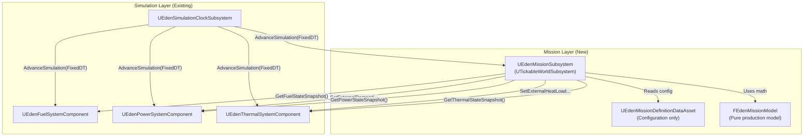
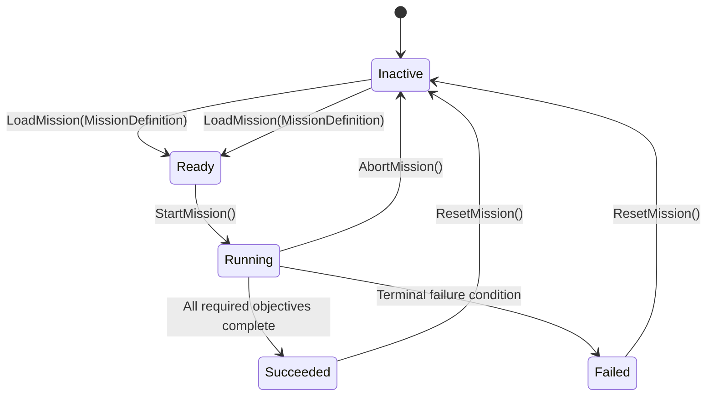

# Emergency Scenario Mission Shell

## Status

Draft

## Prerequisite status

> [!CAUTION]
> ExecPlan 0003 (spacecraft resource simulation) is implemented and all automated validation passes (101 Eden tests, runtime composition/reset coverage). However, 0003 remains **Blocked** pending final hands-on PIE verification.
>
> - Do not mark 0003 Complete.
> - Do not create the `v0.2.0-resource-simulation` tag.
> - Do not modify the resource implementation as part of this task.
> - Implementation authorization for Checkpoint A is **withheld** until this ExecPlan is reviewed and explicitly approved.

## Repository state

| Field | Value |
|---|---|
| Branch | `plan/emergency-mission-shell` |
| Parent branch | `feature/spacecraft-resource-simulation` at `b19242e` |
| Resource baseline | Automated validation passing; PIE gate open |
| Working tree | Clean |

---

## 1. Problem and outcome

The verified resource simulation gives the spacecraft fuel, power, and thermal state, but there is no mission context: no objectives, no emergency events, no success/failure evaluation, and no deterministic restart. The PROJECT_SPEC requires "one emergency scenario" and "mission result" for the first vertical slice.

This milestone introduces:

- **`UEdenMissionSubsystem`** — a `UTickableWorldSubsystem` that owns mission lifecycle, active mission definition, mission elapsed time, objective runtime state, scheduled event execution, and mission outcome.
- **`FEdenMissionModel`** — a pure production model for deterministic timeline stepping, objective evaluation, and outcome resolution, testable without a world.
- **`UEdenMissionDefinitionDataAsset`** — a configuration-only Data Asset defining mission identifier, phases, objectives, scheduled events, and success/failure conditions. Never owns mutable runtime state.
- **Mission event commands** — deterministic, typed command structs that flow through existing resource component public APIs. The mission subsystem sends commands; resource components remain authoritative state owners.
- **Objective evaluation** — mission objectives observe authoritative resource snapshots and produce deterministic Pending/Active/Completed/Failed state.
- **Solar Event Emergency** — the first concrete scenario configured as a `UEdenMissionDefinitionDataAsset`, exercising warning → impact → recovery → resolution flow through the reusable framework.
- **Deterministic restart** — mission reset clears mission-owned state and mission-applied resource modifiers without silently owning resource reset.
- **Debug visibility** — mission state exposed through `ShowDebug EdenSystems` (extended) and `ShowDebug EdenMission`.
- **Project-specific logging** — via existing `LogEdenMission` category.

The outcome is a reusable mission/emergency framework where the first playable scenario demonstrates:

```
Normal operation → warning → timed disturbances → player response → objective evaluation → explicit success or failure → deterministic restart
```

---

## 2. Scope

### In scope

- `UEdenMissionSubsystem` (`UTickableWorldSubsystem`) with mission lifecycle state machine, timeline stepping, and mission elapsed time.
- `FEdenMissionModel` — pure production model for timeline math, objective evaluation, and outcome resolution.
- `EEdenMissionState` — lifecycle enum: `Inactive`, `Ready`, `Running`, `Succeeded`, `Failed`.
- `EEdenMissionPhase` — generic phase enum: `Nominal`, `Warning`, `Impact`, `Recovery`, `Resolved`.
- `FEdenMissionObjectiveConfig` — configuration-only objective definition.
- `FEdenMissionObjectiveRuntime` — mutable runtime objective state (Pending, Active, Completed, Failed).
- `FEdenMissionEventConfig` — configuration-only scheduled event definition with simulation-time trigger.
- `FEdenMissionEventRuntime` — mutable runtime event execution state (Pending, Executed, Skipped).
- `UEdenMissionDefinitionDataAsset` — configuration-only Data Asset with editor-time `IsDataValid`.
- Mission event commands issued through existing resource component public APIs:
  - `UEdenThermalSystemComponent::SetHeatGenerationDegreesCelsiusPerSecond()`
  - `UEdenThermalSystemComponent::SetDissipationDegreesCelsiusPerSecond()`
  - `UEdenPowerSystemComponent::SetGenerationKilowatts()`
  - `UEdenPowerSystemComponent::SetBaselineDemandKilowatts()`
  - New: `UEdenThermalSystemComponent::SetExternalHeatLoadDegreesCelsiusPerSecond()` (additive external heat, separating mission-driven load from baseline)
  - New: `UEdenPowerSystemComponent::SetExternalDemandKilowatts()` (additive external demand, separating mission-driven load from baseline)
- Mission-applied resource modifier tracking and cleanup.
- `FEdenMissionStateSnapshot` — read-only query data for future HUD/EDEN OS.
- Deterministic mission restart: clears mission-owned state, clears mission-applied resource modifiers, does not silently reset unrelated spacecraft state.
- Automated unit, integration, and runtime composition tests.
- Manual PIE verification gate.
- Development-only debug visibility extension.

### Out of scope

- Production HUD / widgets
- Polished UI
- Voice acting
- EDEN OS AI integration
- LLM integration
- Telemetry transport
- Multiplayer
- Save / load
- Procedural missions
- Random event generation
- Oxygen / life support
- Docking
- Combat
- Inventory / crafting
- Detailed solar physics simulation
- Visual effects polish
- Audio polish
- Additional emergency scenarios beyond the first solar event
- Fuel-based flight shutdown

---

## 3. Codebase discovery

### 3.1 Existing public APIs available for mission commands

The resource components already expose sufficient mutation commands for the first emergency scenario:

| Component | Command | Can mission use? |
|---|---|---|
| `UEdenThermalSystemComponent` | `SetHeatGenerationDegreesCelsiusPerSecond(float)` | Yes — increase thermal load |
| `UEdenThermalSystemComponent` | `SetDissipationDegreesCelsiusPerSecond(float)` | Yes — reduce dissipation |
| `UEdenThermalSystemComponent` | `SetTemperatureCelsius(float)` | Avoid — prefer rate changes |
| `UEdenPowerSystemComponent` | `SetGenerationKilowatts(float)` | Yes — reduce solar panel output |
| `UEdenPowerSystemComponent` | `SetBaselineDemandKilowatts(float)` | Yes — increase emergency demand |
| `UEdenPowerSystemComponent` | `SetBatteryChargeKilowattHours(float)` | Avoid — prefer rate changes |
| `UEdenFuelSystemComponent` | `SetConsumptionDemandNormalized(float)` | Indirect — already driven by propulsion |
| `UEdenFuelSystemComponent` | `SetFuelQuantityKilograms(float)` | Avoid — not needed for solar event |

**Assessment:** The existing thermal and power setter APIs are sufficient for rate-based disturbances. The mission should prefer rate commands (`SetHeatGeneration…`, `SetGeneration…`, `SetBaselineDemand…`) over direct value writes (`SetTemperature…`, `SetBatteryCharge…`).

**New APIs needed:** Two additive external load commands to separate mission-driven modifications from baseline configuration:

1. `UEdenThermalSystemComponent::SetExternalHeatLoadDegreesCelsiusPerSecond(float)` — additive to baseline heat generation during `AdvanceSimulation`.
2. `UEdenPowerSystemComponent::SetExternalDemandKilowatts(float)` — additive to baseline demand during `AdvanceSimulation`.

These allow the mission to apply and clear disturbances without needing to know the original configured values, enabling clean modifier removal.

### 3.2 Existing observation APIs for objectives

| Component | Query | Objective use |
|---|---|---|
| `UEdenThermalSystemComponent` | `GetThermalStateSnapshot()` → `TemperatureCelsius`, `ThermalState` | "Keep temperature below X" |
| `UEdenPowerSystemComponent` | `GetPowerStateSnapshot()` → `ChargeFraction`, `PowerState` | "Restore power above X" |
| `UEdenFuelSystemComponent` | `GetFuelStateSnapshot()` → `FuelFraction`, `FuelState` | "Survive with fuel remaining" |
| `UEdenSimulationClockSubsystem` | `GetElapsedSimulationTimeSeconds()` | "Survive until time T" |

**Assessment:** Fully sufficient. Objectives observe existing snapshots, never mutate state.

### 3.3 Existing delegates for event observation

| Component | Delegate | Payload |
|---|---|---|
| `UEdenFuelSystemComponent` | `OnFuelStateChanged(Previous, New)` | State transition |
| `UEdenFuelSystemComponent` | `OnFuelDepleted()` | Terminal |
| `UEdenPowerSystemComponent` | `OnPowerStateChanged(Previous, New)` | State transition |
| `UEdenPowerSystemComponent` | `OnPowerDepleted()` | Terminal |
| `UEdenThermalSystemComponent` | `OnThermalStateChanged(Previous, New)` | State transition |
| `UEdenThermalSystemComponent` | `OnThermalOverheated()` | Terminal |
| `UEdenSimulationClockSubsystem` | `OnSimulationClockOverrun(DroppedSteps)` | Clock health |

**Assessment:** Mission failure detection can bind to terminal delegates (`OnThermalOverheated`, `OnPowerDepleted`, `OnFuelDepleted`). The mission subsystem may also poll snapshots during its fixed-step evaluation. Both approaches are safe.

### 3.4 Missing APIs

| What | Why needed |
|---|---|
| `SetExternalHeatLoadDegreesCelsiusPerSecond` on thermal | Additive mission heat separate from baseline |
| `SetExternalDemandKilowatts` on power | Additive mission demand separate from baseline |
| `ClearExternalHeatLoad` / `ClearExternalDemand` | Clean modifier removal on mission reset |
| Snapshot extension for mission state | `FEdenMissionStateSnapshot` for debug/HUD |
| `LogEdenMission` definition (already declared) | Already exists in `EdenLogCategories.h` |

### 3.5 Existing reset chain

```
AEdenFlightPlayerController::Reset()
  → ClearFlightInputIntent()
  → AEdenSpacecraftPawn::ResetFlightState()
    → UEdenFlightMovementComponent::ResetFlightMovement()

Resource components:
  UEdenFuelSystemComponent::ResetFuelState()
  UEdenPowerSystemComponent::ResetPowerState()
  UEdenThermalSystemComponent::ResetThermalState()

Clock:
  UEdenSimulationClockSubsystem::ResetSimulationClock()
```

**Assessment:** Mission restart must coordinate: (1) clear mission-owned state, (2) clear mission-applied external modifiers, (3) call existing resource resets, (4) reset simulation clock. The mission subsystem orchestrates this sequence but does not own resetting flight state or resource internals.

### 3.6 Build.cs dependencies

Current: `Core`, `CoreUObject`, `Engine`, `InputCore`, `EnhancedInput`. No additional module dependencies required for mission types.

### 3.7 Log categories

`LogEdenMission` is already declared but not yet defined. The `.cpp` that defines it will be added with the mission subsystem implementation.

---

## 4. Architecture

### 4.1 Alternatives considered

#### Mission timing approach

| Approach | Pros | Cons | Decision |
|---|---|---|---|
| **A. Mission subsystem implements `IEdenSimulationTickable`** | Receives fixed-step callbacks at the same cadence as resource systems; deterministic | Must register as clock subscriber; tightly couples stepping order to subscriber registration order | **Selected** |
| B. Mission subsystem observes elapsed simulation time | Looser coupling; can evaluate at any point | Non-deterministic timing relative to resource steps; extra query overhead | Rejected |
| C. Separate mission clock | Complete independence | Unnecessary complexity; two clocks to coordinate; violates single-clock architecture | Rejected |

**Decision:** The mission subsystem implements `IEdenSimulationTickable` and registers with `UEdenSimulationClockSubsystem`. This ensures mission events and objectives are evaluated at the same fixed cadence as resource simulation. The subscriber registration order in the clock naturally determines stepping order: resource components step first (registered at `BeginPlay`), then the mission subsystem (registered when a mission starts).

#### Event command approach

| Approach | Pros | Cons | Decision |
|---|---|---|---|
| **A. Typed USTRUCT command payloads executed by mission subsystem** | Type-safe; deterministic; clean command/ownership boundary; extensible | Requires one struct per command type | **Selected** |
| B. Enum + generic float payload | Compact; fewer types | Loses type safety; ambiguous payloads | Rejected |
| C. UObject event definitions | Most extensible; polymorphic | Heavyweight for first scenario; GC overhead; unnecessary indirection | Rejected |
| D. Command interface (`IEdenMissionCommandTarget`) on resources | Polymorphic dispatch | Resources don't need to know about missions; violates dependency direction | Rejected |

**Decision:** Use typed `USTRUCT` command payloads. Each event in the mission definition specifies a command type (enum) and associated parameters. The mission subsystem interprets the command and calls the appropriate existing resource component public API. The resource components never know about missions.

#### Objective model

| Approach | Pros | Cons | Decision |
|---|---|---|---|
| **A. Config struct + runtime struct, evaluated by mission subsystem** | Clean separation; pure model testable; deterministic | Requires struct definitions | **Selected** |
| B. UObject per objective | Polymorphic; self-evaluating | Heavyweight for first scenario; lifecycle complexity | Rejected |
| C. Blueprint-defined objectives | Maximum content flexibility | Violates C++-owns-rules principle; hard to test deterministically | Rejected |

**Decision:** Objectives are plain USTRUCT pairs: `FEdenMissionObjectiveConfig` (configuration) and `FEdenMissionObjectiveRuntime` (mutable runtime state). The pure `FEdenMissionModel` evaluates objectives against system snapshots.

#### Mission phase model

| Approach | Pros | Cons | Decision |
|---|---|---|---|
| **A. Generic enum phases driven by timeline events** | Reusable across scenarios; framework-level concept | Slightly more structure than timeline-only | **Selected** |
| B. Scenario-specific phase identifiers | Maximum flexibility per scenario | Hard-codes concepts into framework | Rejected |
| C. Timeline events only, no phase concept | Simplest | No high-level state for debug/HUD; harder to reason about mission progression | Rejected |

**Decision:** `EEdenMissionPhase` is a generic enum (`Nominal`, `Warning`, `Impact`, `Recovery`, `Resolved`) that the mission definition's scheduled events can transition. The phase is metadata for debug/HUD/objective conditions, not a hard-coded scenario concept.

### 4.2 Recommended architecture



**Command direction:** Mission subsystem → resource component public APIs (downward).
**Observation direction:** Mission subsystem ← resource component snapshots (read-only).
**Dependency direction:** Mission depends on Systems and Core. Systems and Core do not depend on Missions.

### 4.3 Fixed-step evaluation ordering

Within each fixed simulation step:

```
1. Resource components AdvanceSimulation(FixedDT)
   - Fuel, Power, Thermal update their authoritative state
2. Mission subsystem AdvanceSimulation(FixedDT)
   a. Advance mission elapsed time
   b. Execute any scheduled events whose trigger time ≤ mission elapsed time
      - Events issue commands to resource components
      - Resource components validate and apply immediately
   c. Evaluate objectives against current resource snapshots
   d. Evaluate mission outcome (success/failure conditions)
   e. If outcome determined, transition mission state
```

**Rationale:** Resources step first so that mission event commands applied during the mission step take effect on the *next* simulation step, not the current one. This prevents within-step circular dependencies and makes the ordering deterministic. Objectives evaluate post-command-issuance against the resource state that includes the *previous* step's results.

**Alternative considered:** Events execute before resource steps. Rejected because it creates a dependency on resource components accepting commands mid-step and evaluating them immediately within the same step.

---

## 5. State ownership table

| Mutable state | Authoritative owner | Readers | Command direction |
|---|---|---|---|
| Simulation time, accumulator, pause | `UEdenSimulationClockSubsystem` | All systems, mission, debug | Clock only |
| Mission lifecycle state (`EEdenMissionState`) | `UEdenMissionSubsystem` | Debug, future HUD | Mission subsystem only |
| Mission elapsed time | `UEdenMissionSubsystem` | Objectives, debug | Mission subsystem only |
| Mission phase (`EEdenMissionPhase`) | `UEdenMissionSubsystem` | Objectives, debug | Mission subsystem only |
| Objective runtime state | `UEdenMissionSubsystem` | Debug, future HUD | Mission subsystem only |
| Event execution state | `UEdenMissionSubsystem` | Debug | Mission subsystem only |
| Mission outcome | `UEdenMissionSubsystem` | Debug, future HUD | Mission subsystem only |
| Mission-applied external heat load | `UEdenThermalSystemComponent` | Mission (via snapshot) | Mission → Thermal command |
| Mission-applied external demand | `UEdenPowerSystemComponent` | Mission (via snapshot) | Mission → Power command |
| Fuel quantity, consumption, fuel state | `UEdenFuelSystemComponent` | Mission (via snapshot), debug | Fuel component only |
| Battery charge, generation, demand, power state | `UEdenPowerSystemComponent` | Mission (via snapshot), debug | Power component only |
| Temperature, heat gen, dissipation, thermal state | `UEdenThermalSystemComponent` | Mission (via snapshot), debug | Thermal component only |
| Propulsion demand | `UEdenFlightMovementComponent` | Fuel (via interface) | Movement component only |
| Spacecraft velocity/transform | `UEdenFlightMovementComponent` | Camera, UI | Movement component only |
| Presentation / debug display | View layer | Developer | Derived from snapshots |

### Prohibited dependencies

| Source | Must NOT depend on |
|---|---|
| `UEdenMissionSubsystem` | UI widgets, EDEN OS, telemetry transport, player controller, concrete pawn class |
| `UEdenFuelSystemComponent` | Mission subsystem, UI widgets, concrete pawn class |
| `UEdenPowerSystemComponent` | Mission subsystem, UI widgets |
| `UEdenThermalSystemComponent` | Mission subsystem, UI widgets |
| `UEdenSimulationClockSubsystem` | Mission subsystem, resource components, UI widgets |
| Future HUD/widgets | Mission subsystem internals (reads snapshots only) |

---

## 6. Mission lifecycle state machine



| State | Description |
|---|---|
| `Inactive` | No mission loaded. Subsystem is idle. |
| `Ready` | Mission definition loaded and validated. Timeline, objectives, and events are initialized but not advancing. |
| `Running` | Mission timeline is advancing with the simulation clock. Events execute, objectives evaluate. |
| `Succeeded` | All required objectives completed. Mission is frozen. |
| `Failed` | A failure condition was met. Mission is frozen. |

**Transition rules:**
- `LoadMission`: validates definition, initializes runtime state, transitions to `Ready`. Rejects if already `Running`.
- `StartMission`: registers with simulation clock, transitions to `Running`. Only valid from `Ready`.
- `AbortMission`: unregisters from clock, clears modifiers, transitions to `Inactive`. Only valid from `Running`.
- `ResetMission`: clears all mission-owned state and mission-applied resource modifiers, transitions to `Inactive`. Valid from `Succeeded` or `Failed`.
- Terminal events: evaluated during `AdvanceSimulation`. Transition is immediate within the step.

---

## 7. Mission event command model

### 7.1 Command types

```cpp
UENUM(BlueprintType)
enum class EEdenMissionCommandType : uint8
{
    None,
    SetMissionPhase,
    SetExternalHeatLoad,
    ClearExternalHeatLoad,
    SetExternalPowerDemand,
    ClearExternalPowerDemand,
    SetPowerGeneration,
    ActivateObjective,
};
```

### 7.2 Event configuration

```cpp
USTRUCT(BlueprintType)
struct FEdenMissionEventConfig
{
    GENERATED_BODY()

    // Unique identifier within the mission definition
    UPROPERTY(EditAnywhere, BlueprintReadOnly)
    FName EventId;

    // Simulation-time trigger (seconds from mission start)
    UPROPERTY(EditAnywhere, BlueprintReadOnly, meta = (ClampMin = "0.0", Units = "s"))
    float TriggerTimeSeconds = 0.0f;

    // Command to execute
    UPROPERTY(EditAnywhere, BlueprintReadOnly)
    EEdenMissionCommandType CommandType = EEdenMissionCommandType::None;

    // Generic float parameter (interpretation depends on CommandType)
    UPROPERTY(EditAnywhere, BlueprintReadOnly)
    float FloatParameter = 0.0f;

    // Generic name parameter (e.g., phase name, objective ID)
    UPROPERTY(EditAnywhere, BlueprintReadOnly)
    FName NameParameter;
};
```

### 7.3 Event execution flow

```
Mission step:
  for each event where TriggerTimeSeconds <= MissionElapsedTime AND event is Pending:
    mark event as Executed
    interpret CommandType:
      SetMissionPhase → update current phase
      SetExternalHeatLoad → call ThermalComponent->SetExternalHeatLoadDegreesCelsiusPerSecond(FloatParameter)
      ClearExternalHeatLoad → call ThermalComponent->SetExternalHeatLoadDegreesCelsiusPerSecond(0.0f)
      SetExternalPowerDemand → call PowerComponent->SetExternalDemandKilowatts(FloatParameter)
      ClearExternalPowerDemand → call PowerComponent->SetExternalDemandKilowatts(0.0f)
      SetPowerGeneration → call PowerComponent->SetGenerationKilowatts(FloatParameter)
      ActivateObjective → transition named objective from Pending to Active
    log event execution to LogEdenMission
```

Events are sorted by `TriggerTimeSeconds` during validation. Events at the same time execute in definition order (stable).

---

## 8. Objective model

### 8.1 Configuration

```cpp
UENUM(BlueprintType)
enum class EEdenObjectiveType : uint8
{
    SurviveUntilTime,         // MissionElapsedTime >= TargetValue
    KeepTemperatureBelow,     // TemperatureCelsius < TargetValue while Active
    RestorePowerAbove,        // ChargeFraction >= TargetValue while Active
    MaintainFuelAbove,        // FuelFraction >= TargetValue while Active
};

UENUM(BlueprintType)
enum class EEdenObjectiveState : uint8
{
    Pending,    // Not yet activated
    Active,     // Currently being evaluated
    Completed,  // Successfully met
    Failed,     // Condition violated
};

USTRUCT(BlueprintType)
struct FEdenMissionObjectiveConfig
{
    GENERATED_BODY()

    UPROPERTY(EditAnywhere, BlueprintReadOnly)
    FName ObjectiveId;

    UPROPERTY(EditAnywhere, BlueprintReadOnly)
    FText DisplayName;

    UPROPERTY(EditAnywhere, BlueprintReadOnly)
    EEdenObjectiveType ObjectiveType;

    UPROPERTY(EditAnywhere, BlueprintReadOnly)
    float TargetValue = 0.0f;

    // Whether this objective is required for mission success
    UPROPERTY(EditAnywhere, BlueprintReadOnly)
    bool bRequired = true;

    // If true, objective starts Active immediately when mission starts
    UPROPERTY(EditAnywhere, BlueprintReadOnly)
    bool bActivateOnStart = false;
};
```

### 8.2 Runtime state

```cpp
USTRUCT()
struct FEdenMissionObjectiveRuntime
{
    GENERATED_BODY()

    FName ObjectiveId;
    EEdenObjectiveState State = EEdenObjectiveState::Pending;
};
```

### 8.3 Evaluation

Objectives are evaluated by `FEdenMissionModel` after event execution within each mission step:

- **SurviveUntilTime:** If `MissionElapsedTime >= TargetValue` and state is `Active`, transition to `Completed`.
- **KeepTemperatureBelow:** If `TemperatureCelsius >= TargetValue` and state is `Active`, transition to `Failed`. If the mission succeeds or resolves while still `Active`, transition to `Completed`.
- **RestorePowerAbove:** If `ChargeFraction >= TargetValue` and state is `Active`, transition to `Completed`.
- **MaintainFuelAbove:** If `FuelFraction < TargetValue` and state is `Active`, transition to `Failed`. Completion on mission resolve.

---

## 9. Success and failure evaluation

### Evaluation timing

Within each mission step, after objective evaluation:

```
if any required objective is Failed → MissionState = Failed
else if all required objectives are Completed → MissionState = Succeeded
else → continue Running
```

### Terminal resource conditions

The mission subsystem may also bind to resource terminal delegates as immediate failure triggers:

- `OnThermalOverheated` → fail "KeepTemperatureBelow" objectives → may trigger mission failure.
- `OnPowerDepleted` → fail relevant objectives → may trigger mission failure.

These are evaluated as objective failures, not as direct mission state mutations, preserving the single evaluation path.

### Ordering guarantee

```
simulation step
  → resource AdvanceSimulation (fuel, power, thermal)
  → mission AdvanceSimulation
    → advance mission elapsed time
    → execute triggered events (issue commands to resources)
    → evaluate objectives against current resource snapshots
    → evaluate outcome
```

This ordering is deterministic because all participants are `IEdenSimulationTickable` subscribers advanced in registration order within the same fixed step.

---

## 10. Reset / restart model

### Mission restart sequence

```
UEdenMissionSubsystem::ResetMission()
  1. Unregister from simulation clock
  2. Clear mission-applied external modifiers:
     - ThermalComponent->SetExternalHeatLoadDegreesCelsiusPerSecond(0.0f)
     - PowerComponent->SetExternalDemandKilowatts(0.0f)
  3. Clear mission-owned state:
     - MissionState = Inactive
     - MissionElapsedTime = 0.0
     - MissionPhase = Nominal
     - Reset all objective runtime states to Pending
     - Reset all event execution states to Pending
     - Clear active mission definition reference
  4. Log mission reset to LogEdenMission
```

### Orchestrated restart (full scenario restart)

A higher-level restart (e.g., game mode `RestartGame()` or a future "Restart Scenario" command) would coordinate:

```
1. MissionSubsystem->ResetMission()           // clears mission state + modifiers
2. FuelComponent->ResetFuelState()             // resource components reset themselves
3. PowerComponent->ResetPowerState()           // resource components reset themselves
4. ThermalComponent->ResetThermalState()        // resource components reset themselves
5. ClockSubsystem->ResetSimulationClock()      // clock resets elapsed time
6. Controller->Reset()                          // clears flight state
7. MissionSubsystem->LoadMission(Definition)   // reload scenario
8. MissionSubsystem->StartMission()            // begin again
```

The mission subsystem orchestrates step 1-2 (its own state and its applied modifiers). Steps 3-8 are coordinated by the game mode or a future restart controller. The mission subsystem does **not** silently call resource resets or clock resets.

---

## 11. Failure-mode analysis

| Failure | Deterministic behavior |
|---|---|
| Missing mission definition | `LoadMission` returns false, logs error, remains `Inactive` |
| Invalid mission configuration (duplicate event IDs, empty objectives, negative times) | `LoadMission` validates via `FEdenMissionModel::ValidateDefinition`; rejects with detailed logged errors |
| Duplicated event IDs | Validation rejects definition |
| Events scheduled at the same time | Allowed; execute in definition order (stable) |
| Large clock catch-up (multiple fixed steps in one frame) | Mission steps multiple times like resource systems; events trigger in order; no double-execution because event state tracks `Executed` |
| Mission paused (clock paused) | Mission does not advance; `AdvanceSimulation` not called; events do not trigger |
| Mission reset midway through event sequence | All event states reset to Pending; external modifiers cleared; partially-applied effects removed |
| Resource component unavailable | Mission subsystem discovers components via pawn accessors; logs warning and skips commands to unavailable components |
| Invalid mission command target | Command execution logs warning, marks event as Executed (not Skipped), continues |
| Objective references unavailable system | Objective evaluation returns safe default (does not fail the objective; logs warning) |
| Repeated success/failure transition | Once `Succeeded` or `Failed`, no further objective evaluation; state is frozen |
| Mission event executing twice | Prevented by `FEdenMissionEventRuntime::State` tracking (Pending → Executed is one-way until reset) |
| Restart leaving stale resource modifiers | `ResetMission` explicitly clears all external modifiers before clearing mission state |
| PIE restart | `UTickableWorldSubsystem::Deinitialize` unregisters; new PIE world creates a fresh subsystem instance |
| `StartMission` called without `LoadMission` | Returns false, logs error, remains current state |
| `StartMission` called while already Running | Returns false, logs warning |
| `ResetMission` called while Running | Returns false, logs warning (use `AbortMission` first) |

---

## 12. Presentation boundary

No production HUD is part of this milestone. Mission state is exposed through:

1. **`FEdenMissionStateSnapshot`** — a read-only struct returned by `UEdenMissionSubsystem::GetMissionStateSnapshot()`:
   ```
   MissionState, MissionPhase, MissionElapsedTimeSeconds,
   ActiveMissionId, ObjectiveSnapshots[], LastExecutedEventId
   ```

2. **`ShowDebug EdenMission`** — development-only debug overlay showing mission lifecycle, phase, timeline progress, objective states, and event execution log.

3. **Extended `ShowDebug EdenSystems`** — add a mission summary line to the existing systems overlay.

No widgets own mission truth.

---

## 13. Solar Event Emergency — first scenario definition

```
Mission ID: SolarEventEmergency
Initial Phase: Nominal

Timeline:
  T=0.0s   → ActivateObjective("SurviveUntilRecovery")
  T=0.0s   → ActivateObjective("KeepTemperatureSafe")
  T=5.0s   → SetMissionPhase(Warning)
  T=10.0s  → SetMissionPhase(Impact)
  T=10.0s  → SetExternalHeatLoad(5.0 °C/s)
  T=10.0s  → SetExternalPowerDemand(3.0 kW)
  T=10.0s  → SetPowerGeneration(0.5 kW)
  T=10.0s  → ActivateObjective("RestorePower")
  T=30.0s  → SetMissionPhase(Recovery)
  T=30.0s  → ClearExternalHeatLoad
  T=30.0s  → SetPowerGeneration(2.0 kW)
  T=45.0s  → ClearExternalPowerDemand
  T=50.0s  → SetMissionPhase(Resolved)

Objectives:
  SurviveUntilRecovery:
    Type: SurviveUntilTime
    TargetValue: 50.0s
    Required: true
    ActivateOnStart: false (activated by T=0 event)

  KeepTemperatureSafe:
    Type: KeepTemperatureBelow
    TargetValue: 100.0  (critical threshold)
    Required: true
    ActivateOnStart: false

  RestorePower:
    Type: RestorePowerAbove
    TargetValue: 0.3  (30% charge)
    Required: false
    ActivateOnStart: false

Success: All required objectives Completed
Failure: Any required objective Failed OR OnThermalOverheated
```

This scenario exercises: phase transitions, multiple simultaneous events, thermal disturbance, power disturbance, two constraint objectives, one time-survival objective, one restoration objective, clean modifier removal, and mission completion.

**Timing values are initial design estimates.** They will be tuned during manual PIE verification.

---

## 14. Test strategy

### 14.1 Pure / unit tests (prefix: `Eden.Unit.Mission.*`)

| Test | Validates |
|---|---|
| `MissionModelValidatesValidDefinition` | Valid definition accepted |
| `MissionModelRejectsDuplicateEventIds` | Duplicate event IDs rejected |
| `MissionModelRejectsEmptyObjectives` | Empty objectives rejected |
| `MissionModelRejectsNegativeEventTime` | Negative trigger time rejected |
| `MissionModelSortsEventsByTime` | Events sorted by trigger time |
| `MissionModelStableOrderSameTimeEvents` | Same-time events preserve definition order |
| `MissionStateTransitionsInactiveToReady` | LoadMission transition |
| `MissionStateTransitionsReadyToRunning` | StartMission transition |
| `MissionStateTransitionsRunningToSucceeded` | All objectives complete |
| `MissionStateTransitionsRunningToFailed` | Required objective fails |
| `MissionStateTransitionsRunningToInactive` | AbortMission |
| `MissionStateRejectsInvalidTransitions` | Invalid transition returns false |
| `MissionTimelineAdvancesWithSimulationStep` | Elapsed time increments |
| `MissionEventTriggersAtCorrectTime` | Event fires when elapsed >= trigger |
| `MissionEventDoesNotExecuteTwice` | Re-stepping past trigger time doesn't re-fire |
| `MissionEventExecutesSameTimeEventsInOrder` | Stable ordering |
| `ObjectiveEvaluationSurviveUntilTime` | Time-based completion |
| `ObjectiveEvaluationKeepTemperatureBelow` | Constraint-based failure |
| `ObjectiveEvaluationRestorePowerAbove` | Threshold-based completion |
| `ObjectiveEvaluationMaintainFuelAbove` | Constraint-based failure |
| `ObjectiveActivationFromEvent` | ActivateObjective command transitions Pending → Active |
| `ObjectiveIgnoredWhenPending` | Pending objectives not evaluated |
| `OutcomeSuccessRequiresAllRequired` | All required completed → success |
| `OutcomeFailureOnAnyRequiredFailed` | Any required failed → failure |
| `OutcomeIgnoresOptionalObjectives` | Optional not required for success |
| `FrozenStateAfterSuccessOrFailure` | No further evaluation after outcome |
| `ResetClearsAllRuntimeState` | Reset returns all runtime to initial |

### 14.2 Integration tests (prefix: `Eden.Integration.Mission.*`)

| Test | Validates |
|---|---|
| `MissionSubsystemReceivesSimulationSteps` | Clock advances mission |
| `MissionEventCommandsReachThermal` | External heat load applied |
| `MissionEventCommandsReachPower` | External demand applied |
| `MissionModifiersClearedOnReset` | External modifiers zeroed after reset |
| `ResourceStateChangeTriggersObjectiveFailure` | Thermal overheated fails constraint objective |
| `DeterministicSuccessScenario` | Full solar event timeline → success |
| `DeterministicFailureScenario` | Thermal overheated during impact → failure |
| `MissionRestartProducesCleanState` | Full restart returns to ready state |
| `MissionAbortClearsModifiers` | Abort mid-scenario clears external loads |
| `MultipleSimulationStepsCatchUp` | Clock catch-up correctly advances mission |

### 14.3 Runtime composition tests (prefix: `Eden.Integration.Runtime.*`)

| Test | Validates |
|---|---|
| `MissionSubsystemExistsInGameWorld` | Subsystem registered |
| `MissionDefinitionAssetLoadsCleanly` | Data Asset loads without error |
| `NoDuplicateMissionSubsystem` | Only one mission authority |

### 14.4 Manual PIE gate

| Step | Expected |
|---|---|
| Open L_FlightSandbox in PIE | Normal spacecraft operation |
| Load and start solar event mission (console or test trigger) | Mission state transitions to Running |
| Observe warning phase at ~T=5s | Phase visible in ShowDebug |
| Observe thermal disturbance at ~T=10s | Temperature rising in ShowDebug |
| Observe power disturbance at ~T=10s | Generation reduced, demand increased |
| Observe recovery phase at ~T=30s | External heat load cleared |
| Reach T=50s without overheating | Mission succeeds |
| Restart scenario | Clean state, resources reset, mission ready |
| Intentionally overheat during impact | Mission fails |
| PIE stop/start | Clean subsystem teardown and recreation |

---

## 15. Proposed file layout

```
Source/EdenSpaceSimulator/
  Public/
    Missions/
      EdenMissionTypes.h              [NEW] - EEdenMissionState, EEdenMissionPhase,
                                              EEdenMissionCommandType, EEdenObjectiveType,
                                              EEdenObjectiveState, FEdenMissionEventConfig,
                                              FEdenMissionObjectiveConfig,
                                              FEdenMissionEventRuntime,
                                              FEdenMissionObjectiveRuntime,
                                              FEdenMissionStateSnapshot
      EdenMissionModel.h              [NEW] - FEdenMissionModel (pure production model)
      EdenMissionDefinitionDataAsset.h [NEW] - UEdenMissionDefinitionDataAsset
      EdenMissionSubsystem.h          [NEW] - UEdenMissionSubsystem
    Systems/
      EdenPowerSystemComponent.h      [MODIFY] - Add SetExternalDemandKilowatts, ClearExternalDemand
      EdenThermalSystemComponent.h    [MODIFY] - Add SetExternalHeatLoadDegreesCelsiusPerSecond, ClearExternalHeatLoad
      EdenPowerModel.h                [MODIFY] - Add external demand to step calculation
      EdenThermalModel.h              [MODIFY] - Add external heat load to step calculation

  Private/
    Missions/
      EdenMissionModel.cpp            [NEW]
      EdenMissionDefinitionDataAsset.cpp [NEW]
      EdenMissionSubsystem.cpp        [NEW]
    Systems/
      EdenPowerSystemComponent.cpp    [MODIFY] - Implement external demand
      EdenThermalSystemComponent.cpp  [MODIFY] - Implement external heat load
      EdenPowerModel.cpp              [MODIFY] - External demand in step
      EdenThermalModel.cpp            [MODIFY] - External heat load in step
    Tests/
      EdenMissionModelTests.cpp       [NEW] - Pure model tests
      EdenMissionSubsystemTests.cpp   [NEW] - Integration tests
      EdenMissionRuntimeTests.cpp     [NEW] - Runtime composition tests

  Content/
    Eden/
      Data/
        Missions/
          DA_SolarEventEmergency.uasset [NEW] - First scenario Data Asset
```

---

## 16. Checkpoint breakdown

### Checkpoint A — Mission core types, state machine, pure model

**Scope:**
- `EdenMissionTypes.h` — all enums, config structs, runtime structs, snapshot struct
- `EdenMissionModel.h/.cpp` — validation, state transitions, timeline stepping, objective evaluation, outcome resolution
- `Eden.Unit.Mission.*` pure model tests (~27 tests)

**Acceptance criteria:**
- All mission type definitions compile
- Pure model tests pass for validation, state transitions, timeline, objectives, and outcome
- No world or subsystem dependency in this checkpoint
- Build passes

**Stop for review.**

---

### Checkpoint B — Mission subsystem and simulation clock integration

**Scope:**
- `EdenMissionSubsystem.h/.cpp` — `UTickableWorldSubsystem`, lifecycle state machine, clock integration, mission definition loading
- `IEdenSimulationTickable` registration/unregistration
- `Eden.Integration.Mission.MissionSubsystemReceivesSimulationSteps`
- `Eden.Integration.Mission.MultipleSimulationStepsCatchUp`

**Acceptance criteria:**
- Mission subsystem initializes in Game and PIE worlds
- Mission subsystem receives fixed-step callbacks from the clock
- LoadMission / StartMission / AbortMission / ResetMission transitions work
- Build and tests pass

**Stop for review.**

---

### Checkpoint C — Mission definition Data Asset and validation

**Scope:**
- `UEdenMissionDefinitionDataAsset` — configuration, `IsDataValid`
- Extend `FEdenMissionModel::ValidateDefinition` for Data Asset integration
- Editor validation tests

**Acceptance criteria:**
- Data Asset compiles and is creatable in editor
- Invalid configurations produce actionable validation errors
- Build and tests pass

**Stop for review.**

---

### Checkpoint D — External modifier APIs on resource components

**Scope:**
- `UEdenThermalSystemComponent::SetExternalHeatLoadDegreesCelsiusPerSecond` / `ClearExternalHeatLoad`
- `UEdenPowerSystemComponent::SetExternalDemandKilowatts` / `ClearExternalDemand`
- Extend `FEdenThermalModel::Step` and `FEdenPowerModel::Step` to include external loads
- Unit tests for external load behavior
- Integration tests: modifier application and clearing

**Acceptance criteria:**
- External heat load is additive to baseline heat generation during thermal step
- External demand is additive to baseline demand during power step
- Setting external load to 0 is equivalent to clearing
- Existing resource tests still pass (no regression)
- Build and all tests pass

**Stop for review.**

---

### Checkpoint E — Mission event execution and command dispatch

**Scope:**
- Event execution within `AdvanceSimulation`
- Command dispatch to resource components
- Command logging
- `Eden.Integration.Mission.MissionEventCommandsReachThermal`
- `Eden.Integration.Mission.MissionEventCommandsReachPower`

**Acceptance criteria:**
- Events trigger at correct simulation times
- Commands reach target resource components
- Event double-execution is prevented
- Same-time events execute in stable definition order
- Build and tests pass

**Stop for review.**

---

### Checkpoint F — Objective and outcome evaluation

**Scope:**
- Objective evaluation within `AdvanceSimulation`
- Outcome evaluation (success/failure)
- Terminal delegate binding for immediate failure
- `Eden.Integration.Mission.DeterministicSuccessScenario`
- `Eden.Integration.Mission.DeterministicFailureScenario`
- `Eden.Integration.Mission.ResourceStateChangeTriggersObjectiveFailure`

**Acceptance criteria:**
- All four objective types evaluate correctly
- Success requires all required objectives completed
- Failure triggers on any required objective failed
- Terminal resource delegate correctly fails constraint objectives
- State is frozen after outcome
- Build and tests pass

**Stop for review.**

---

### Checkpoint G — Solar Event Emergency Data Asset and runtime integration

**Scope:**
- Create `DA_SolarEventEmergency.uasset` with the first scenario configuration
- Full end-to-end integration test with the Data Asset
- `Eden.Integration.Mission.MissionRestartProducesCleanState`
- `Eden.Integration.Mission.MissionAbortClearsModifiers`
- `Eden.Integration.Mission.MissionModifiersClearedOnReset`
- Runtime composition tests

**Acceptance criteria:**
- Data Asset loads and validates cleanly
- Full scenario timeline produces deterministic success
- Full scenario with forced overheating produces deterministic failure
- Restart produces clean state
- Abort clears modifiers
- Runtime composition tests pass
- Build and all tests pass

**Stop for review.**

---

### Checkpoint H — Debug visibility and manual PIE closeout

**Scope:**
- `ShowDebug EdenMission` implementation
- Extended `ShowDebug EdenSystems` with mission summary line
- Manual PIE verification gate
- Documentation updates (ARCHITECTURE.md, REMEMBER.md, RECOVER.md)
- VerifyMissionAssets.py editor script

**Acceptance criteria:**
- Debug overlay displays mission state, phase, timeline, objectives, events
- All automated tests pass (Eden.*)
- Manual PIE gate completed and recorded
- Documentation synchronized
- Git diff reviewed

**Stop for review. ExecPlan 0004 completion gate.**

---

## 17. Rollback plan

| Checkpoint | Rollback |
|---|---|
| A | Delete `Missions/` source files; no external dependencies |
| B | Delete subsystem files; no resource component changes yet |
| C | Delete Data Asset files; no resource component changes yet |
| D | Revert external modifier APIs on resource components; pure additions with no functional change when unused |
| E | Revert mission event dispatch; resource components unaffected |
| F | Revert objective evaluation; resource components unaffected |
| G | Delete Data Asset; revert integration; resource components retain external modifier APIs (safe) |
| H | Revert debug visibility additions |

At any point, if the mission architecture is fundamentally wrong, return to the `feature/spacecraft-resource-simulation` branch at `b19242e`.

---

## Implementation authorization

> [!IMPORTANT]
> Implementation of Checkpoint A is **withheld** until:
> 1. This ExecPlan is reviewed and explicitly approved.
> 2. The planning branch is merged or rebased appropriately.
> 3. A feature branch (`feature/emergency-mission-shell`) is created.
>
> ExecPlan 0003 PIE gate closure is independent of 0004 design approval but is required before 0004 Checkpoint H manual PIE verification.
